# IfsSync2

## 용도

AWS S3 API 기반 실시간 백업 유틸리티

## 주요 기능

* AWS S3기반의 개인 PC 파일의 실시간 백업 지원
  * InfiniStor 스토리지와 연동 가능
  * 추가적으로 s3 기반 저장소를 최대 3개까지 연동 가능
* 사용자가 제공하는 UI를 통해 Instant, RealTime, Schedule 방식의 백업 작업 추가 가능
* 새로운 백업 작업이 추가될 때마다 별도의 탭에서 세부적인 백업 설정, 모니터링, 제어 가능
* 백업 작업별로 저장소를 선택할 수 있으며, 백업할 폴더와 확장자를 선택 가능
* 특정 PC를 관리자가 원격으로 백업 설정 가능 (InfiniStor 스토리지와 연동 시)
* 윈도우 스케줄러를 이용하여 백업 프로세스를 관리

 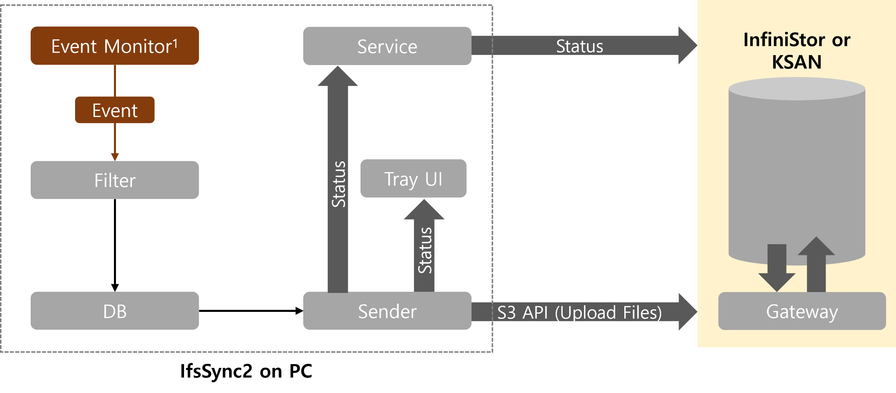
 
* 참고1: Event Monitor(1)
 * Event Monitor는 OS에서 발생하는 File Operation 관련 이벤트를 callback 하는 라이브러리를 사용하여 구현 가능합니다.
 * 현재 프로그램에서 사용한 라이브러리는 [CBFS](https://www.callback.com/cbfsfilter/) 이며 nuget으로 설치하여 사용 할 수 있습니다.
 * CBFS는 유료 라이브러리이며 빌드를 위해서는 라이센스를 구입하거나 트라이얼용 키를 별도로 받아 MainData.RUNTIME_LICENSE_KEY에 입력하여 사용해야 합니다.
* 참고2: 중앙관리 기능(Global Backup Job)은 공개 소스 내에 포함되어 있지만, 이 기능을 사용하기 위해서는 Infinistor와의 연동이 필요합니다.

## 구동 환경

* OS : Windows 7 이상
* .NET Framework 3.1 이상

## 알려진 문제점 및 권고사항

* 현재는 Windows만 지원
* 네트워크 드라이브를 백업경로에 포함할 경우 네트워크 드라이브의 종류에 따라 일부 데이터가 백업이 되지 않을 수 있음.
* Real Time Job 및 Schedule Job에서 아웃룩 파일(.pst) 백업 경우 설정에 따라 증분 백업이 되지 않을 수 있음
* 단일 파일의 용량이 크거나(e.g. 아웃룩 파일(.pst) 등) 과도하게 자주 갱신되는 파일(e.g. DB 파일 등)을 백업하고자 할 때에는 별도의 Schedule Job으로 해당 파일들을 등록하고 백업 주기를 최대한 길게 설정하는 방식으로 백업 부하를 줄일 수 있음
* Default Storage를 등록하면 해당 스토리지 시스템에 설정되어 있는 Global Job이 자동으로 등록될 수 있으며, Global Job은 스토리지 관리자만 수정 및 삭제가 가능함
* Summary 탭 Job Information의 Status가 업데이트 되지 않는 문제가 발생 할 경우 재실행하여 해결 할 수 있음.

## 추가 예정

* 알려진 이슈 수정
* .NET Framework 3.1에서 .NET Core 5.0으로 변경 예정
* MacOS 버전 개발

## How to Build

1. VisualStudio 설치
2. Sync2UI.sln 파일 열기
3. 빌드
   1. 일괄 빌드
      1. 메뉴에서 빌드 -> 일괄빌드 선택
      2. 일괄빌드 창에서 AnyCPU 항목만 체크후 빌드
   2. 개별 빌드
      1. 빌드하고 싶은 프로젝트를 선택
      2. 빌드

## How to Use

### 빌드한 경우

1. IfsSync 폴더를 C:\Program Files\PSPACE 로 복사
2. IfsSync로 이동
3. IfsSync2UI.exe 파일 실행

### 설치 파일을 이용하는 경우

* IfsSync\Setup에서 원하는 버전 다운로드 후 설치

## IfsSync2 Guide

### Install (Windows Only)

1. IfsSync2_2.x.x.x_oooooo_Setup_x64.exe 형식의 설치 배포 파일을 이용해 설치 진행
2. 실행한 설치 프로그램의 안내대로 설치를 진행

* Password의 기본값은 admin
* 프로그램이 실행되지 않는다면 (<https://dotnet.microsoft.com/download/dotnet-framework/net472>) URL에서 Download .NET Framework 4.7.2 Runtime을 다운받아 설치

### UnInstall (Windows Only)

* 제어판 > 프로그램 기능 > IfsSync2_2.xxxx를 선택하여 제거
* 또는 프로그램 설치경로(ex. C:\Program Files\PSPACE)에 있는 unins00x.exe 프로그램을 실행하여 제거

### Summary Tab

* IfsSync2는 실행은 바탕화면의 IfsSync2UI.exe 바로가기를 열거나 프로그램 설치경로 (ex. C:\Program Files\PSPACE\Ifssync2)의 IfsSync2UI.exe 프로그램을 구동하면 됩니다.

 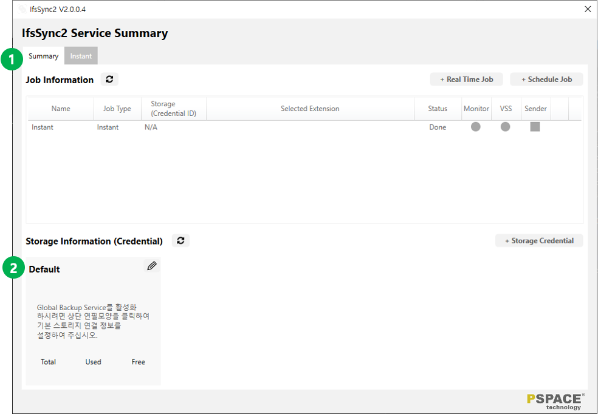

1. fsSync2 Service Summary 페이지 (설치 후 첫번째 실행 상태)
2. IfsSync2를 최초로 실행한 경우 Default Storage 또는 S3 호환 Storage 등록이 필요함

### 백업용 Storage 설정

#### (1) Default Storage 설정 방법

 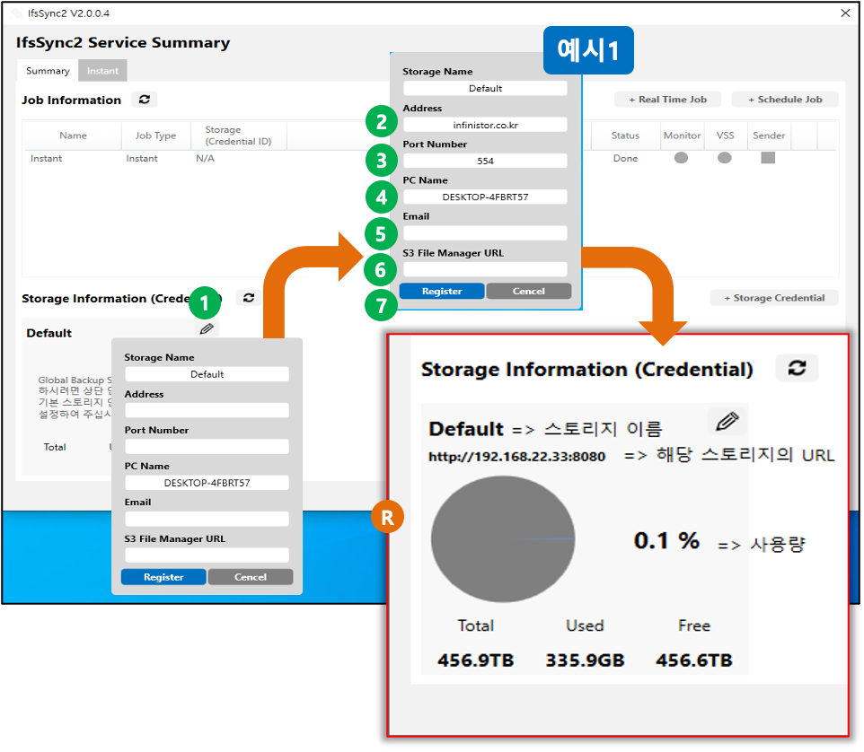

1. Default Storage 정보 설정 편집 아이콘 클릭
2. Address : IfsSync2 IP주소 또는 도메인 입력
3. Port Number : 포트 정보 입력 (기본값은 554)
4. PC Name : 자동으로 현재 PC의 이름을 입력(변경 가능)
5. Email : 사용자의 이메일을 입력(옵션)
6. S3 File Manager URL : Default 스토리지가 활성화 되면 자동으로 입력됨(초기값 입력 또는 변경 가능)
7. [Register] 버튼으로 설정을 적용

* 주소가 틀렸을 경우 에러메시지를 출력합니다. 문제없을 경우 **[R]** 화면으로 변경됩니다.

#### (2) Storage Credential 추가 방법

 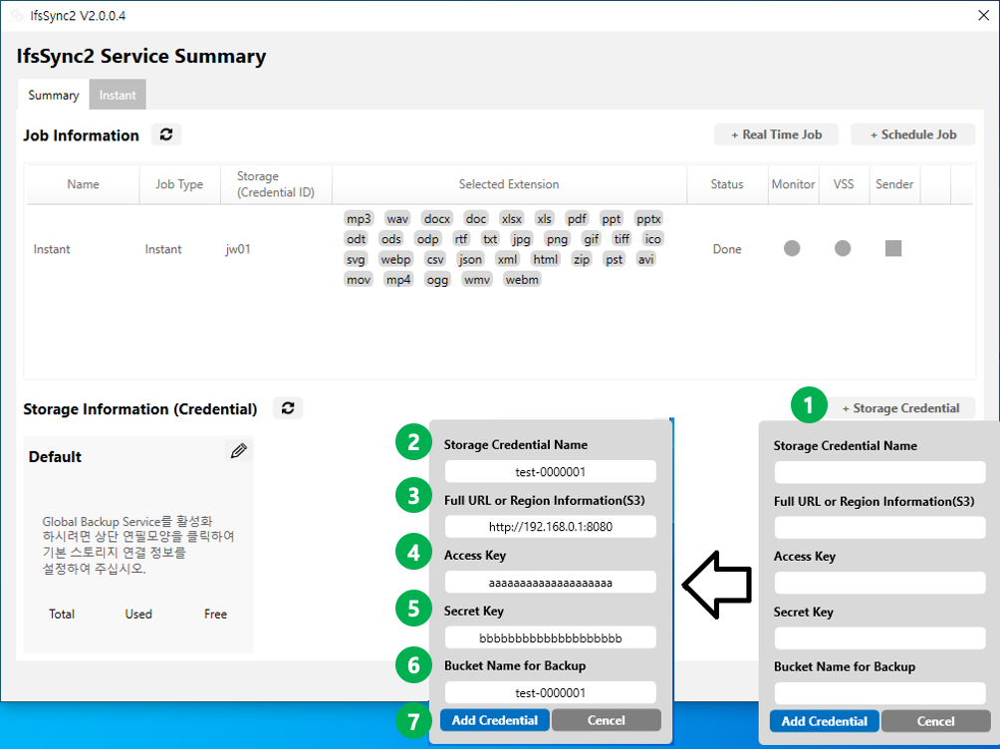

1. [+Storage Credential] 버튼을 클릭해 S3 호환의 Cloud Storage를 백업용으로 추가
2. Storage Credential Name : 스토리지를 구분하기 위한 이름 (사용자 입력)
3. Full URL or Region Information(S3) : S3 호환 Storage Service의 경우 URL 입력
   1. AWS S3의 경우 Region Information 정보를 입력(e.g. ap-northeast-2)
4. Access Key : S3 호환 Storage Service에서 제공 받은 Access Key
5. Secret Key : S3 호환 Storage Service에서 제공 받은 Secret Key
6. Bucket Name for Backup : S3 호환 Storage Service에서 백업 용도로 사용할 Bucket 정보 입력
7. [Add Credential] 버튼으로 추가

* Key, URL 값이 틀리거나 잘못된 User Name을 입력하면 에러메시지가 표시되며 등록되지 않습니다.

### 백업용 Storage 정보 삭제

* [+Storage Credential]로 추가된 백업용 Storage 정보는 삭제 가능합니다.
* 백업용 Storage 정보를 삭제할 경우 관련된 모든 IfsSync2 Job이 자동으로 삭제됩니다.

 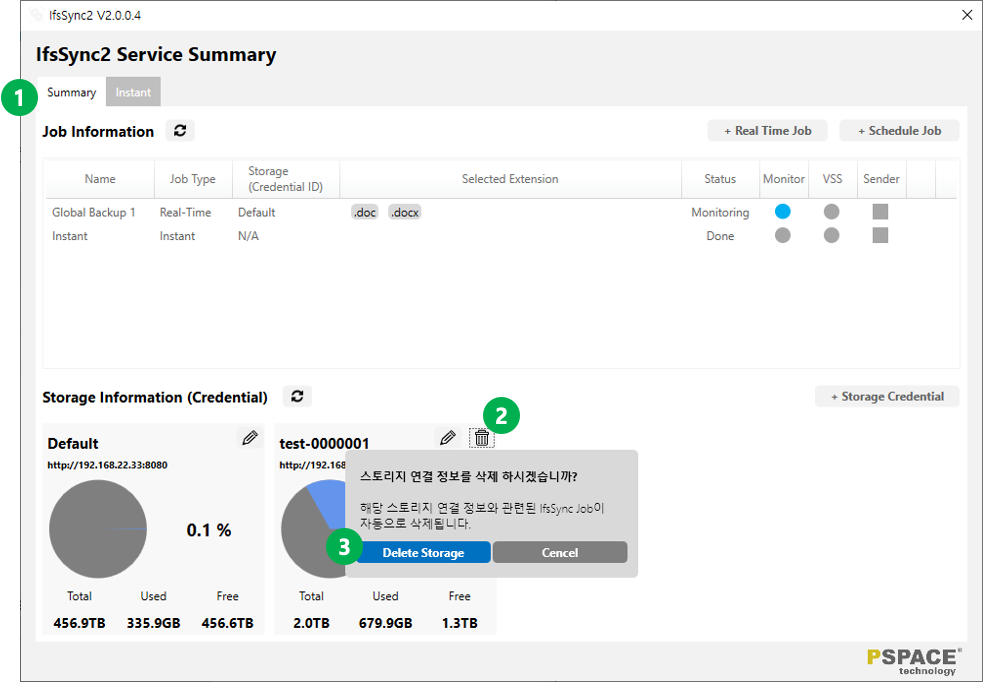

1. IfsSync2 Service Summary 페이지로 이동
2. 삭제하고자 할 백업용 Storage 섹션에서 휴지통 아이콘을 클릭
3. [Delete Storage] 버튼을 클릭하여 해당 백업용 Storage 정보를 삭제 처리

### Instant Job

* IfsSync2 Instant Job은 Full 백업만 지원합니다.
* IfsSync2 Instant Job은 RealTime Job 및 Schedule Job 수행 전에 기존 파일에 대한 초기 백업에도 활용할 수 있습니다.
  * 참고: RealTime Job 및 Schedule Job의 경우 Job 등록 이후부터 수정 또는 생성된 파일에 대해서만 백업함

#### Instant Job 설정 및 실행

 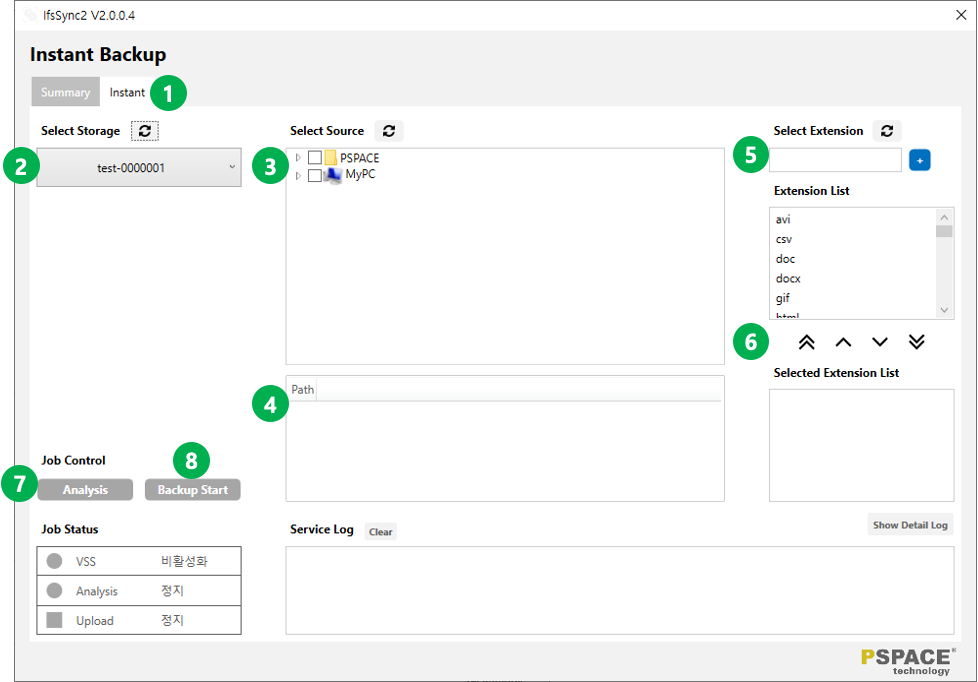

1. Instant Tab으로 이동
2. Instant 백업에 사용할 Storage 선택
3. 백업할 경로를 설정
4. 3에서 선택한 백업 경로를 확인 및 관리 가능
5. 파일 타입(확장자)을 리스트 추가 파일 타입(확장자) 리스트 중 일부 또는 전체를 백업용 타일 타입으로 지정함
6. [Analysis] 버튼을 클릭하면 3\~6에 설정한 값을 기반으로 백업 대상 파일 개수를 점검할 수 있음
7. [Backup Start]를 클릭하여 Instant Job이 수행됨

#### Instant Job 수행 상태 확인 및 제어

* Instant Job을 중지(Quit)하더라도 이미 백업된 데이터는 삭제하지 않습니다.
* VSS(Volume Shadow Copy Services) : Job Status에서 VSS가 활성화되어 있다는 표시는 해당 경로의 백업시점 생성을 의미합니다.

 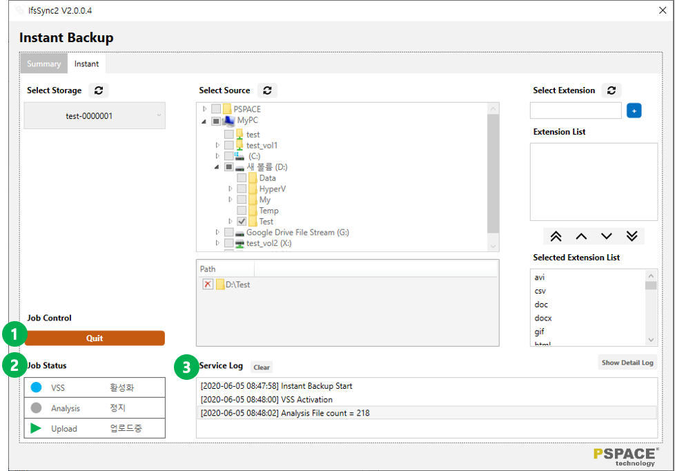

1. Instant Job을 수행하면 Job Control 세션에 [Quit] 버튼이 활성화됨
2. 수행 중인 Instant Job의 주요 상태를 모니터링
3. 수행 중인 Instant Job의 Log를 확인

### Real Time Job

* IfsSync2 Real Time Job은 Job 등록 이후 시점부터 사용자가 지정한 경로 및 확장자에 해당하는 파일의 변경 사항을 실시간으로 추적하여 파일 백업 목록을 실시간으로 갱신합니다.
* IfsSync2 Real Time Job은 상기 파일 백업 목록이 생성될 때마다 순차적으로 실시간 백업합니다.

#### Real Time Job 등록 및 관리

 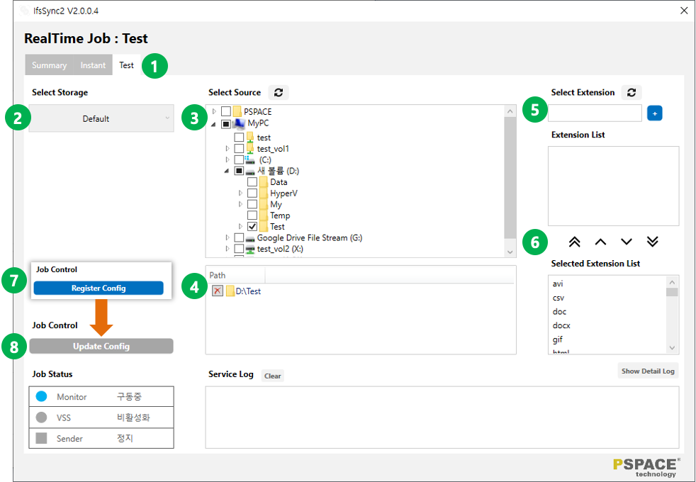

1. Summary 화면 우측 상단의 [+ Real Time Job] 버튼을 이용해 Job을 생성하면 설정한 Job 이름과 동일한 Tab이 생성됨
2. Instant 백업에 사용할 Storage 선택
3. 백업할 경로를 설정
4. 3에서 선택한 백업 경로를 확인 및 관리 가능
5. 파일 타입(확장자)을 리스트 추가
6. 파일 타입(확장자) 리스트 중 일부 또는 전체를 백업용 타일 타입으로 지정함
7. [Register Config] 버튼을 클릭하면 3\~6에 설정한 값을 기반으로 Real Time Job이 등록 및 백업이 시작됨
8. Real Time Job 등록 이후에는 [Update Config] 버튼을 이용해 백업 설정을 갱신 (백업 설정을 수정하면 자동으로 활성화됩니다.)

### Schedule Job

* IfsSync2 Schedule Job은 Job 등록 이후 시점부터 사용자가 지정한 경로 및 확장자에 해당하는 파일의 변경 사항을 실시간으로 추적하여 파일 백업 목록을 실시간으로 갱신합니다.
* IfsSync2 Schedule Job은 상기 파일 백업 목록을 기반으로 사용자가 지정한 시간에 일괄 백업합니다.

#### Schedule Job 등록 및 관리

 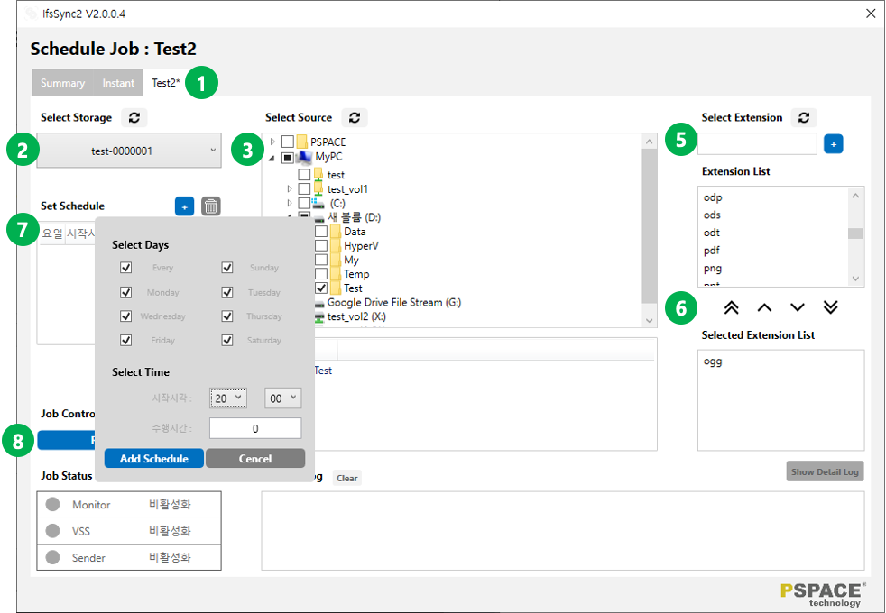

1. Summary 화면 우측 상단의 [+ Schedule Job] 버튼을 이용해 Job을 생성하면 설정한 Job 이름과 동일한 Tab이 생성됨
2. Instant 백업에 사용할 Storage 선택
3. 백업할 경로를 설정
4. 3에서 선택한 백업 경로를 확인 및 관리 가능
5. 파일 타입(확장자)을 리스트 추가
6. 파일 타입(확장자) 리스트 중 일부 또는 전체를 백업용 타일 타입으로 지정함
7. 백업 수행 시간을 설정함 (다중 스케쥴 등록 가능)
8. [Register Config] 버튼을 클릭하면 3\~7에 설정한 값을 기반으로 Schedule Job이 등록되며 사용자가 지정한 시간까지 백업 수행(업로드)를 대기함

### Real Time / Schedule Job 삭제

* IfsSync2 Job을 삭제하면 다시 복원할 수 없습니다.
* IfsSync2 Job이 삭제되더라도 이미 백업된 데이터는 삭제되지 않습니다.
* 백업된 데이터를 삭제하려면 해당 백업용 Storage Service의 담당자에게 문의하거나 수동으로 접근해 삭제하여야 합니다.

 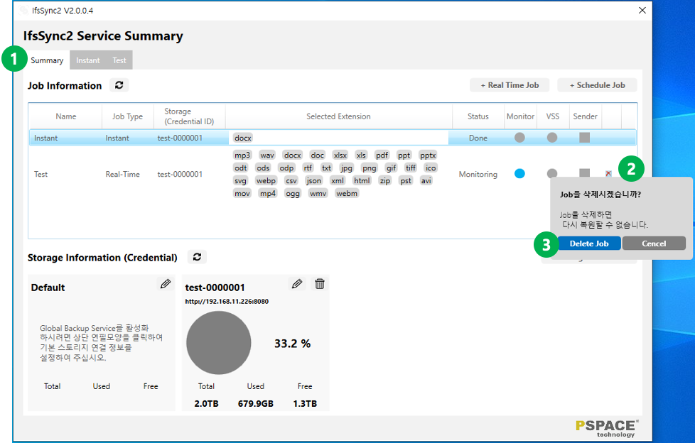

1. Summary 화면으로 이동
2. 삭제할 Job의 우측 [X] 버튼을 클릭
3. [Delete Job] 버튼으로 해당 Job을 삭제 처리

### Log View

* Job 화면에서 [Show Detail Log] 버튼을 누르면 해당 Job의 상세한 성공과 실패 로그를 볼 수 있습니다.
* Log View 팝업을 실행 시 자동으로 1회 갱신되며 이 후 Refresh버튼을 통해 로그를 갱신할 수 있습니다.
* [Clear] 버튼은 현재 Log View 목록에서만 제거하며, 실제 DB에서는 삭제하지 않습니다.
* [Refresh] 버튼은 새로운 로그만 Log View 목록에 추가합니다.
* [Save csv] 버튼은 선택한 Log View 목록을 csv파일로 저장합니다.

 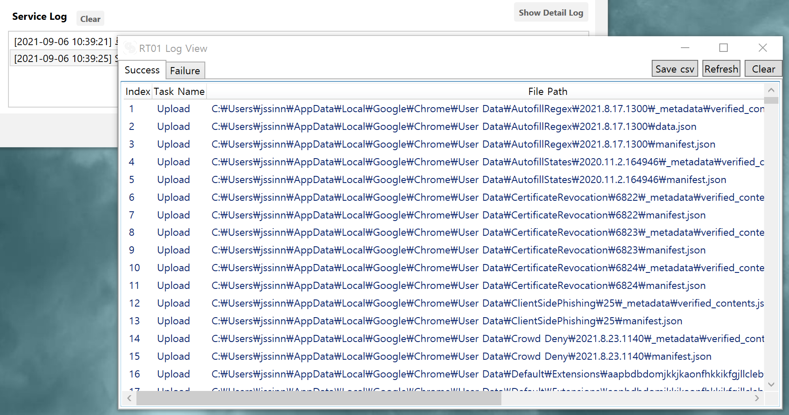
